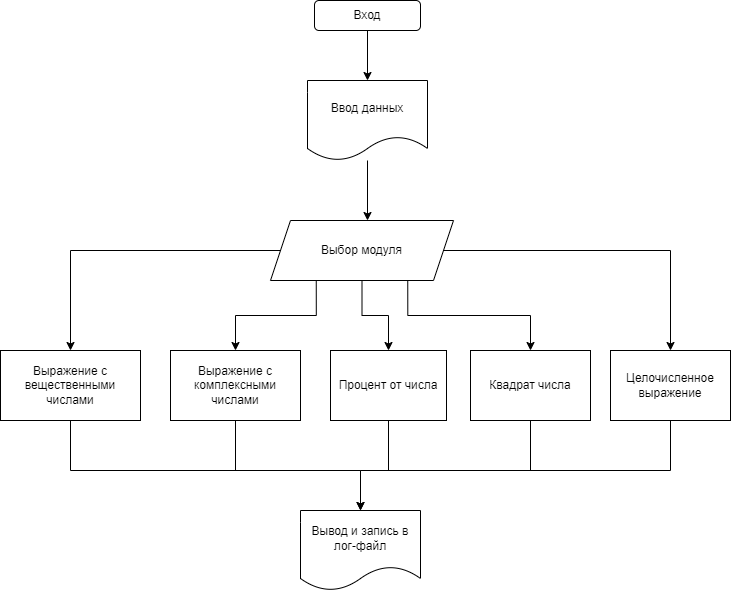

# Домашняя работа в группах: калькулятор комплексных и вещ.чисел

`Рабочая группа:`
* [Майк](https://github.com/unnamemik) - повелител я все сам
* [Таня](https://github.com/SoleaT) - администратор
* [Оля](https://github.com/OlgaLob) - начальник буковок
* [Витя](https://github.com/RemoveFire) - любитель лямбд
* [Валера](https://github.com/ValeriyMakushev) - считатель комплексных чисел
* [Алёна](https://github.com/AlyonaTru) - ревьюер в пледе
___
Так как мы международная компания, то наша программа переведена на английский профессиональным переводчиком.

## Что вообще тут происходит? Вот это:

## Модули и файлы программы
1. Калькулятор Calc.py
2. Модуль обработки вещественных чисел float_mod.py
3. Модуль обработки операций % и квадратный корень percentage_square.py
4. Модуль обработки комплексных чисел complex_valera.py
6. Модуль записи/чтения логов log.py
7. Лог-файл py_log.log

### По модулям распределение этих людей выше следующее:
* Майк - сборка, ввод, целые числа ✅
* Таня - гитхаб и его оформление, вещественные числа  ✅
* Оля - работа с логами ✅
* Валера - комплексные числа ✅
* Витя - проценты и квадраты/кубы ✅
* Алёна всё осмотрела и перевела, вещественные числа ✅

